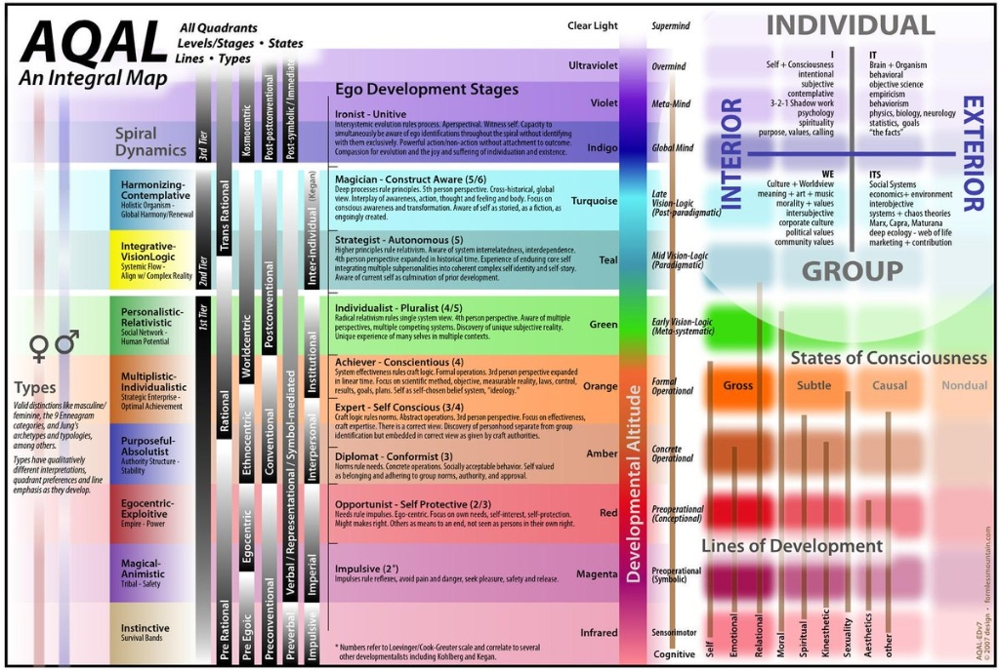
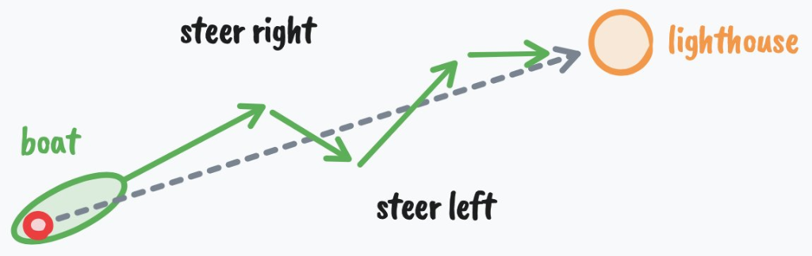

# Como consertar sua vida inteira em 1 dia

**DAN KOE**  
@thedankoe  
12 Jan

Se você é como eu, acha que resoluções de ano novo são estúpidas.

Porque a maioria das pessoas aborda a mudança de suas vidas de forma completamente errada. Elas criam essas resoluções porque todo mundo faz – criamos um significado superficial a partir de jogos de status – mas elas não atendem aos requisitos para uma verdadeira mudança, que vai muito mais fundo do que convencer a si mesmo de que você será mais disciplinado ou produtivo este ano.

Se você é uma dessas pessoas, não estou aqui para menosprezá-lo (costumo ser um pouco duro na minha escrita). Já desisti de 10x mais objetivos do que alcancei. Acho que deveria ser assim para a maioria das pessoas. Mas o fato de que as pessoas tentam mudar suas vidas e fracassam completamente quase sempre permanece verdadeiro.

No entanto, por mais que eu ache resoluções de ano novo estúpidas, é sempre sábio refletir sobre a vida que você odeia para que possa se lançar em direção a algo muito melhor, como discutiremos.

Então, seja você querer iniciar o negócio, transformar seu corpo, ou correr o risco em direção a uma vida mais significativa sem desistir depois de 2 semanas, quero compartilhar 7 ideias que você provavelmente não ouviu antes sobre mudança de comportamento, psicologia e produtividade para que você possa fazer exatamente isso em 2026.

Isso será abrangente.

Esta não é uma daquelas cartas que você lê e esquece.

Isso é algo que você vai querer marcar, fazer anotações e reservar um tempo para pensar.

O protocolo no final (para mergulhar profundamente em sua psique e descobrir o que você realmente quer na vida) levará cerca de um dia inteiro para ser concluído, com efeitos que duram muito mais do que isso.

Vamos começar.

## Sumário

- [I – Você não está onde quer estar porque não é a pessoa que estaria lá](#i--você-não-está-onde-quer-estar-porque-não-é-a-pessoa-que-estaria-lá)
- [II – Você não está onde quer estar porque não quer estar lá](#ii--você-não-está-onde-quer-estar-porque-não-quer-estar-lá)
- [III – Você não está onde quer estar porque tem medo de estar lá](#iii--você-não-está-onde-quer-estar-porque-tem-medo-de-estar-lá)
- [IV – A vida que você quer está dentro de um nível específico de mente](#iv--a-vida-que-você-quer-está-dentro-de-um-nível-específico-de-mente)
- [V – Inteligência é a capacidade de obter o que você quer da vida](#v--inteligência-é-a-capacidade-de-obter-o-que-você-quer-da-vida)
- [VI – Como se lançar em uma vida completamente nova (em 1 dia)](#vi--como-se-lançar-em-uma-vida-completamente-nova-em-1-dia)
- [VII – Transforme sua vida em um videogame](#vii--transforme-sua-vida-em-um-videogame)

## I – Você não está onde quer estar porque não é a pessoa que estaria lá

Quando se trata de estabelecer grandes objetivos, as pessoas tendem a focar em um dos dois requisitos para o sucesso:

1. Mudar suas ações para progredir em direção ao objetivo (menos importante, segunda ordem)
2. Mudar quem você é para que seu comportamento naturalmente siga (mais importante, primeira ordem)

A maioria das pessoas estabelece um objetivo superficial, se empolga para permanecer disciplinada nas primeiras semanas, depois volta aos velhos hábitos sem muita luta, porque estavam tentando construir uma grande vida sobre uma fundação podre.

Se isso não faz sentido, vamos ver um exemplo.

Pense em alguém bem-sucedido. Pode ser um fisiculturista com um ótimo físico, um fundador/CEO que vale centenas de milhões, ou um cara carismático que consegue conversar com um grupo sem um pingo de ansiedade entrando em sua mente.

Você acha que o fisiculturista tem que "ralar" para comer saudável? O CEO tem que se disciplinar para aparecer e liderar a equipe? Para você, pode parecer assim na superfície, mas a verdade é que eles não conseguem se ver vivendo de outra maneira. O fisiculturista tem que ralar para comer de forma não saudável. O CEO tem que se forçar a ficar na cama depois do despertador, e eles odeiam cada segundo disso (há nuances aqui, apenas me acompanhe por um segundo).

Para algumas pessoas, meu próprio estilo de vida parece um pouco extremo e disciplinado. Para mim, é natural, e não digo isso para contrastá-lo com qualquer outro tipo de estilo de vida. Eu simplesmente gosto de viver assim. Quando minha mãe me diz que eu deveria fazer uma pausa, sair e me divertir... eu seguro minha língua de dizer a ela: "Se eu não estivesse me divertindo, por que estaria fazendo o que estou fazendo?"

A próxima frase pode soar simples, mas é desconcertante quantas pessoas não entendem.

**Se você quer um resultado específico na vida, você deve ter o estilo de vida que cria esse resultado muito antes de alcançá-lo.**

Se alguém diz que quer perder 30 quilos, muitas vezes não acredito neles. Não porque não acho que sejam capazes, mas porque há muitas vezes em que essa mesma pessoa diz: "Mal posso esperar até terminar de perder peso para poder começar a curtir a vida novamente." Odeio ter que te contar, mas se você não adotar o estilo de vida que levou você a perder o peso, para a vida toda, e encontrar uma razão com uma força gravitacional maior do que aquela que te prende aos seus velhos caminhos, então você voltará direto para onde começou, e pode dizer infelizmente que desperdiçou o recurso que você nunca terá de volta: tempo.

Quando você realmente muda a si mesmo, todos os seus hábitos que não movem a agulha em direção ao seu objetivo se tornam repugnantes, porque você tem uma consciência profunda e profunda de que tipo de vida essas ações se acumulam. Você está bem com seus padrões atuais porque não está totalmente ciente do que eles são ou para onde levam. Vamos discutir como descobrir isso, mas precisamos construir até lá.

Você diz que quer mudar. Você diz que quer "se tornar financeiramente livre" e "ficar saudável", mas suas ações mostram o contrário por uma razão. E vai muito mais fundo do que você pensa.

## II – Você não está onde quer estar porque não quer estar lá

> Confie apenas no movimento. A vida acontece no nível dos eventos, não das palavras. Confie no movimento.
> 
> – Alfred Adler

Se você quer mudar quem você é, deve entender como a mente funciona para que possa começar a reprogramá-la.

O primeiro passo para entender a mente é entender que todo comportamento é orientado a objetivos. É teleológico. Quando você pensa sobre isso, isso é meio óbvio, mas quando nos aprofundamos, a maioria das pessoas não quer ouvir.

Você dá um passo à frente porque quer alcançar um determinado local.

Você coça o nariz porque quer fazer a coceira ir embora.

Esses são claros, mas na maioria das vezes, seus objetivos são inconscientes. Você pode não perceber que quando se senta no sofá no meio do dia, está tentando queimar tempo antes de sua próxima responsabilidade, como um exemplo simples.

Em um nível ainda mais inconsciente e complexo, você persegue objetivos que podem prejudicá-lo, mas justifica suas ações de uma maneira que é socialmente aceitável e não faz você parecer um perdedor.

Como exemplo, se você não consegue parar de procrastinar seu trabalho, pode justificar com o fato de que você "não tem disciplina", mas na realidade, está tentando alcançar um objetivo como sempre faz. Nesse caso, esse objetivo poderia ser se proteger do julgamento que vem de terminar e compartilhar seu trabalho.

Se você diz que quer sair do seu emprego sem saída, mas permanece nele sem qualquer razão real, pode começar a pensar que não tem coragem suficiente, ou que nunca foi realmente um "tomador de riscos", mas a verdade é que você está perseguindo o objetivo de segurança, previsibilidade e uma desculpa para não parecer um fracassado para todos os outros em sua vida que veem trabalhar em um emprego sem saída como um sinal de sucesso.

A lição aqui é que a mudança real requer mudar seus objetivos.

Não quero dizer estabelecer algum objetivo superficial porque o ato de fazer isso serve a um objetivo inconsciente que está realmente prejudicando você. Isso já foi discutido o suficiente no espaço de produtividade. Quero dizer mudar seu ponto de vista. Porque é isso que um objetivo é. Um objetivo é uma projeção no futuro que atua como uma lente de percepção que permite que você perceba informações, ideias e recursos que ajudam você a alcançar esse objetivo.

Agora vamos nos aprofundar um pouco mais, porque se você não entender isso, só fica mais difícil de sair.

## III – Você não está onde quer estar porque tem medo de estar lá

> O importante para você lembrar é que não importa minimamente como você obteve a ideia ou de onde ela veio. Você pode nunca ter conhecido um hipnotizador profissional. Você pode nunca ter sido formalmente hipnotizado. Mas se você aceitou uma ideia - de si mesmo, de seus professores, de seus pais, amigos, anúncios, de qualquer outra fonte - e ainda, se você está firmemente convencido de que a ideia é verdadeira, ela tem o mesmo poder sobre você que as palavras do hipnotizador têm sobre o sujeito hipnotizado.
> 
> – Maxwell Maltz

Aqui está como você se tornou quem você é hoje, e como você se tornará quem será amanhã. Esta é a anatomia da identidade:

1. Você quer alcançar um objetivo
2. Você percebe a realidade através da lente desse objetivo
3. Você só percebe informações e ideias "importantes" que permitem que você alcance esse objetivo (aprendizado)
4. Você age em direção a esse objetivo e recebe feedback de que está progredindo em direção a ele
5. Você repete esse comportamento até que se torne automático e inconsciente (condicionamento)
6. Esse comportamento se torna parte de quem você pensa que é ("Eu sou o tipo de pessoa que...")
7. Você defende sua identidade para manter a consistência psicológica
8. Sua identidade molda novos objetivos, reiniciando o ciclo, e se essa identidade é desvantajosa para uma boa vida, isso fica muito ruim muito rápido

A realidade infeliz é que você deve quebrar o ciclo entre os passos 6 e 7, mas este processo começa quando você é criança.

Você tem o objetivo de sobrevivência.

Você depende de seus pais para ensinar como sobreviver. Você teve que se conformar. E como a maneira como a maioria das pessoas ensina é através de recompensa e punição, a menos que você adote suas crenças e valores, você será punido. Você não pensa realmente por si mesmo até ver através disso.

Mas seus pais também passaram por esse processo ao longo de suas vidas inteiras. É aí que pode ficar perigoso. Seus pais, a menos que tenham quebrado o padrão eles mesmos, foram condicionados pelas ideias culturalmente aceitas de sucesso da era Industrial. Eles também carregam o melhor e o pior condicionamento de seus pais e dos pais de seus pais.

Para levar isso a uma camada mais profunda, uma vez que você atende suas necessidades de sobrevivência física (o que é bastante fácil de fazer no mundo de hoje, você praticamente nasce em segurança), você começa a sobreviver no nível conceitual ou ideológico. Você pode não tentar proteger e reproduzir seu corpo, mas você absolutamente protege e reproduz sua mente. Não é difícil ver a guerra de ideias na internet, e os participantes são identidades individuais e de grupo.

Quando seu corpo se sente ameaçado, você entra em luta ou fuga.

Quando sua identidade se sente ameaçada, a mesma coisa acontece.

Se você está fortemente identificado com uma ideologia política (pelo processo de que falamos há pouco), você se sentirá ameaçado quando alguém desafiar suas crenças. Você literalmente sente o estresse. Você sente, emocionalmente, como se tivesse acabado de levar um tapa na cara. Como a maioria das pessoas não analisa suas emoções em busca da verdade, você tende a ficar preso em câmaras de eco e redobrar reivindicações que prejudicam você e os outros.

Se você foi criado em uma família religiosa e não pensou por si mesmo, você lutará e atacará outros que ameaçam sua segurança psicológica dentro dessa pequena bolha.

A mesma coisa acontece quando você inconscientemente se vê como um advogado, um jogador ou alguém que não tomaria as ações para alcançar uma vida melhor.

## IV – A vida que você quer está dentro de um nível específico de mente

A mente evolui através de estágios previsíveis ao longo do tempo.

Quando você nasce, você é como uma pequena esponja de sobrevivência que absorve quaisquer crenças que puder (que são fortemente ditadas por sua cultura) para que você possa se sentir seguro. E se você não tomar cuidado, sua mente pode se cristalizar e pode tornar difícil viver uma vida significativa.

Isso foi documentado o suficiente em modelos como a Hierarquia de Maslow, os estágios de desenvolvimento do ego de Loevinger, Spiral Dynamics e Teoria Integral, cada um construindo um sobre o outro, mas também não é difícil de observar na sociedade.

Já falei sobre isso muitas vezes, e sintetizei em meu próprio modelo Human 3.0 com vários prompts de IA para descobrir seu nível de desenvolvimento e um caminho a seguir (abra em uma aba para ler depois se quiser), mas aqui está o 80/20 dos 9 estágios de desenvolvimento do ego como um lembrete (porque a repetição ajuda a revelar coisas que você não notou antes, e há novas pessoas lendo essas cartas):

**Impulsivo** — Sem separação entre impulso e ação. Pensamento preto e branco. Ex: Uma criança bate quando está com raiva porque o sentimento e o comportamento são a mesma coisa.

**Auto-Protetor** — O mundo é perigoso e você aprende a cuidar de si mesmo. Ex: Uma criança aprende a esconder boletins, mentir sobre tarefas e descobrir o que os adultos querem ouvir.

**Conformista** — Você é seu grupo e suas regras parecem a própria realidade. Ex: Alguém que genuinamente não consegue compreender por que alguém votaria diferentemente de sua família ou grupo.

**Auto-Consciente** — Você percebe que tem uma vida interior que não corresponde ao exterior. Ex: Sentado na igreja e percebendo que você não tem certeza se acredita no que todos ao seu redor parecem acreditar, mas não sabendo o que fazer com esse sentimento ainda.

**Conscencioso** — Você constrói seu próprio sistema de princípios e se responsabiliza por eles. Ex: Deixar a religião de sua família após estudo cuidadoso e adotar uma filosofia pessoal que você pode defender, ou construir um plano de carreira com marcos claros porque você acredita que o esforço certo produz os resultados certos.

**Individualista** — Você vê que seus princípios foram moldados pelo contexto e começa a mantê-los mais frouxamente. Ex: Perceber que suas visões políticas têm mais a ver com onde você cresceu do que com a verdade objetiva, ou perceber que seus objetivos de carreira ambiciosos eram realmente sobre ganhar a aprovação de seu pai.

**Estrategista** — Você trabalha com sistemas enquanto está ciente de seu próprio envolvimento neles. Ex: Liderar uma organização enquanto questiona ativamente seus próprios pontos cegos, ou se envolver na política sabendo que sua perspectiva é parcial e moldada por preconceitos que você não pode ver completamente.

**Consciente da Construção** — Você vê todas as estruturas, incluindo sua identidade, como ficções úteis. Ex: Manter suas crenças espirituais de forma metafórica, não literal, sabendo que o mapa não é o território, ou se observar desempenhar o papel de "fundador" ou "líder de pensamento" com uma espécie de divertimento gentil.

**Unitivo** — A separação entre o eu e a vida se dissolve. Ex: Trabalho, descanso e diversão parecem a mesma coisa. Não há mais ninguém que precise se tornar algo, apenas presença respondendo ao que surge.

Para a maioria das pessoas lendo isso, eu assumiria que você paira entre 4 e 8, o que é uma enorme lacuna. Aqueles mais próximos de 8 estão lendo isso para aprender algo ou passar o tempo de maneira não destrutiva. Aqueles mais próximos de 4 estão realmente procurando uma mudança. Você sente que foi feito para mais, mas não pode entender tudo ainda, porque obviamente há muito em jogo.

A boa notícia é que não importa realmente em que estágio você está, porque passar por qualquer um deles segue um padrão.

## V – Inteligência é a capacidade de obter o que você quer da vida

> O único teste real de inteligência é se você consegue o que quer da vida.
> 
> – Naval Ravikant

Há uma fórmula para o sucesso.

Um ingrediente é a capacidade de agir (agency).

Um ingrediente é oportunidade (que muitas pessoas gostam de confundir com "privilégio" - porque lhes faltam os outros ingredientes).

O último ingrediente é inteligência.

Se você tem alta capacidade de agir mas baixa oportunidade, não importa quão provável você é de agir em direção a um objetivo, porque não é um objetivo que dará muitos frutos.

Se você tem oportunidade e capacidade de agir mas baixa inteligência, então você nunca será totalmente capaz de se beneficiar dessa oportunidade.

Primeiro, já falamos sobre capacidade de agir antes aqui. Em termos de oportunidade, não posso te dizer para mudar sua localização física, mas se você não vê a abundância de oportunidade digital bem na sua frente, não sei o que te dizer.

Dito isso, quero focar no que é inteligência no contexto desses dois outros ingredientes e desta carta. Para isso, olhamos para a cibernética.

Cibernética vem da palavra grega kybernetikos que significa "dirigir" ou "bom em dirigir".

Também é conhecida como "a arte de obter o que você quer".

Então, se a definição de inteligência de Naval é obter o que você quer da vida, entender cibernética te ajuda a fazer isso muito mais rápido.

A cibernética ilustra as propriedades de sistemas inteligentes.

- Ter um objetivo
- Agir em direção a esse objetivo
- Sentir onde você está
- Comparar com o objetivo
- E agir novamente com base nesse feedback

Você pode julgar a inteligência com base na capacidade do sistema de iterar e persistir com tentativa e erro.

Um navio desviado do curso que se corrige em direção ao seu destino. Um termostato sentindo uma mudança no calor e ligando. O pâncreas excretando insulina após os picos de glicose no sangue.

O que isso tem a ver com obter o que você quer da vida?

Tudo.

Agir, sentir, comparar e entender o sistema de uma meta-perspectiva é fundamental para alta inteligência (com a definição que estamos usando aqui).

Alta inteligência é a capacidade de iterar, persistir e entender o quadro geral. A marca de baixa inteligência é a incapacidade de aprender com seus erros.

Pessoas de baixa inteligência ficam presas em problemas em vez de resolvê-los. Elas encontram um obstáculo e desistem. Como um escritor que falha em construir um público leitor e desiste porque não tem a capacidade de tentar coisas novas, experimentar e descobrir um processo que funciona para eles (pensar que não há um processo eficaz que você possa criar é comprovadamente falso, não importa suas crenças limitantes, daí ser de baixa inteligência.)

Alta inteligência é perceber que qualquer problema pode ser resolvido em uma escala de tempo grande o suficiente. A realidade é que você pode alcançar qualquer objetivo que você decida.

Inteligência é perceber que há uma série de escolhas que você pode fazer que levam a alcançar o objetivo que você quer. Você entende que as ideias são hierárquicas e que você não pode ir do papiro aos Google Docs de uma só vez. Mesmo que esse objetivo seja impossível agora, você simplesmente não tem os recursos – que podem ser inventados nos próximos anos – para alcançar essa coisa.

Quando falo sobre "objetivos", e como continuarei repetindo, não estou falando da lente típica de auto-ajuda, embora seja uma lente útil de adotar às vezes.

Estou falando da lente da teleologia ou do kosmos grego – que tudo serve a um propósito. Que tudo é parte de um todo maior.

Objetivos determinam como você vê o mundo.

Objetivos determinam o que você considera "sucesso" ou "fracasso".

Você pode tentar "aproveitar a jornada", mas se você perseguir o objetivo errado, você não vai aproveitá-la.

Sua mente é o sistema operacional da realidade.

Esse sistema é composto de objetivos.

Para a maioria das pessoas, esses objetivos são atribuídos a elas. Programados como linhas de código em sua psique.

Vá para a escola. Consiga o emprego. Fique ofendido. Faça-se de vítima. Aposente-se aos 65.

Um caminho conhecido que não funciona.

Para se tornar mais inteligente, você deve:

- Rejeitar o caminho conhecido
- Mergulhar no desconhecido
- Estabelecer novos objetivos mais elevados para expandir sua mente
- Abraçar o caos e permitir o crescimento
- Estudar os princípios generalizados da natureza
- Tornar-se um generalista profundo

Eu entendo que esta pode não ser a definição tradicional de inteligência, mas essa sequência de passos leva a um nível extraordinário de conexões em seu cérebro, levando ao que observaríamos como uma pessoa inteligente. Combine isso com capacidade de agir e você tem um vencedor.

Isso nos leva perfeitamente para a próxima seção.

## VI – Como se lançar em uma vida completamente nova (em 1 dia)

Os melhores períodos da minha vida sempre vieram após um período de ficar absolutamente farto da falta de progresso que estava fazendo.

Como você mergulha em sua mente?

Como você se torna consciente de seu condicionamento?

Como você alcança insights e verdades profundos que mudam a trajetória de sua vida?

Através do ato simples, mas muitas vezes doloroso, de questionar.

Algo que tão poucas pessoas fazem, e você pode perceber pela forma como falam ou dão suas opiniões sobre um tópico específico. Questionar é pensar, e muito poucas pessoas fazem isso.

Quero te dar um protocolo abrangente que você pode usar todos os anos para reiniciar sua vida e se lançar em uma temporada de progresso intenso. Este protocolo ajuda você a fazer as perguntas certas.

Essas perguntas cobrirão do macro ao micro: onde você quer estar, o que você precisa fazer para chegar lá e o que você pode fazer imediatamente para começar a mover a agulha em direção a essa realidade.

Isso exigirá um dia inteiro para ser concluído, então recomendo que você siga o protocolo exato. Você precisará de uma caneta, papel e uma mente aberta.

Quando observo padrões em pessoas que viram com sucesso sua identidade, isso acontece rápido após um acúmulo de tensão. Especificamente, notei 3 fases pelas quais as pessoas tendem a passar.

**Dissonância** – Elas sentem que não pertencem à sua vida atual e ficam suficientemente fartas de sua falta de progresso.

**Incerteza** – Elas não sabem o que vem a seguir, então ou experimentam ou se perdem e se sentem piores.

**Descoberta** – Elas descobrem o que querem perseguir e fazem 6 anos de progresso em 6 meses.

Então, nosso objetivo com este protocolo é ajudá-lo a alcançar o ponto de dissonância, navegar pela incerteza e descobrir o que realmente é que você quer alcançar, tanto que a clareza é esmagadora e as distrações não têm mais peso.

Este protocolo é estruturado para que possa ser concluído em um dia. De manhã, você faz uma escavação psicológica para descobrir seus próprios motivos ocultos. Durante o dia, você se provoca com interrupções para mantê-lo fora do piloto automático e contemplar sua vida. À noite, você sintetiza os insights em uma direção em que começará a se mover amanhã.

Não posso garantir que isso funcionará para todos, porque não posso garantir que todos que leem isso estão no capítulo certo de sua própria história que tornaria esses pontos impactantes. Você não pode colocar o clímax no início do livro e esperar que seja interessante.

### Parte 1) Manhã – Escavação psicológica – Visão & anti-visão

Primeiro devemos criar um novo quadro, ou lente de percepção, para sua mente operar.

Isso é como criar uma nova concha, deixar a antiga e lentamente crescer nela ao longo do tempo. Não parecerá que se encaixa no início. Isso é uma coisa boa.

Reserve 15-30 minutos (a duração de um vídeo do YouTube... você pode fazer isso) para pensar e responder a essas perguntas. Não tente terceirizar essa contemplação para IA. Quero que você ultrapasse o limitador que está em sua mente. Se você não conseguir responder imediatamente, volte a elas mais tarde.

1. Qual é a insatisfação enfadonha e persistente com a qual você aprendeu a viver? Não o sofrimento profundo, mas o que você aprendeu a tolerar. (Se você não odeia, você vai tolerar)

2. Do que você reclama repetidamente, mas nunca realmente muda? Escreva as três reclamações que você expressou com mais frequência no ano passado.

3. Para cada reclamação: O que alguém que assistisse ao seu comportamento (não suas palavras) concluiria que você realmente quer?

4. Qual verdade sobre sua vida atual seria insuportável admitir para alguém que você respeita profundamente?

Essas perguntas têm o objetivo de fazer você tomar consciência da dor em sua vida atual. Agora, precisamos transformar isso no que chamo de "anti-visão", que é uma consciência brutal da vida que você não quer viver. Dessa forma, você pode usar essa energia negativa para direcionar seus esforços em uma direção positiva e agir de um lugar de motivação intrínseca.

5. Se absolutamente nada mudar nos próximos cinco anos, descreva uma terça-feira comum. Onde você acorda? Como seu corpo se sente? Qual é a primeira coisa que você pensa? Quem está ao seu redor? O que você faz entre 9h e 18h? Como você se sente às 22h?

6. Agora faça isso, mas para dez anos. O que você perdeu? Quais oportunidades fecharam? Quem desistiu de você? O que as pessoas dizem sobre você quando você não está na sala?

7. Você está no fim de sua vida. Você viveu a versão segura. Você nunca quebrou o padrão. Qual foi o custo? O que você nunca se permitiu sentir, tentar ou se tornar?

8. Quem em sua vida já está vivendo o futuro que você acabou de descrever? Alguém cinco, dez, vinte anos à frente na mesma trajetória? O que você sente quando pensa em se tornar eles?

9. Que identidade você teria que desistir para realmente mudar? ("Eu sou o tipo de pessoa que...") O que custaria a você socialmente não ser mais essa pessoa?

10. Qual é a razão mais embaraçosa pela qual você não mudou? Aquela que faz você parecer fraco, assustado ou preguiçoso em vez de razoável?

11. Se seu comportamento atual é uma forma de autoproteção, o que exatamente você está protegendo? E o que essa proteção está custando a você?

Se você respondeu a essas verdadeiramente, e se você está no capítulo certo de sua vida, você sentirá uma profunda sensação de desconforto e possivelmente repugnância por como você está vivendo atualmente. Agora, precisamos orientar essa energia em uma direção positiva. Precisamos criar uma visão mínima viável, porque sua visão é como um produto. Começa pouco clara, mas com tempo e experiência, fica mais forte e mais potente.

1. Esqueça a praticidade por um minuto. Se você pudesse estalar os dedos e estar vivendo uma vida diferente em três anos, não o que é realista, o que você realmente quer? Como é uma terça-feira comum? Mesmo nível de detalhe da pergunta 5.

2. O que você teria que acreditar sobre si mesmo para que essa vida parecesse natural em vez de forçada? Escreva a declaração de identidade: "Eu sou o tipo de pessoa que..."

3. Qual é uma coisa que você faria esta semana se você já fosse essa pessoa?

Responda todas essas logo pela manhã amanhã.

### Parte 2) Durante o dia – Interrompendo o piloto automático – Quebrando padrões inconscientes

Esses exercícios de diário são bonitos, mas queremos mudança real.

Francamente, isso não vai acontecer se você não quebrar os padrões inconscientes atuais que estão mantendo você o mesmo.

Durante o dia, quero que você contemple tudo o que escreveu na parte um. Além disso, não quero que você esqueça de contemplar. Por favor, leve isso a sério. Você não vai mudar fazendo a mesma coisa pelo resto de sua vida. Você precisa forçar conscientemente uma quebra de padrão.

Reserve um tempo agora para criar lembretes ou eventos de calendário em seu telefone. Inclua a pergunta no lembrete ou evento para que você possa começar imediatamente a pensar sobre isso.

Quanto mais aleatórios e não conflitantes com sua agenda forem, melhor.

- **11:00**: O que estou evitando agora fazendo o que estou fazendo?
- **13:30**: Se alguém filmasse as últimas duas horas, o que concluiria que eu quero da minha vida?
- **15:15**: Estou me movendo em direção à vida que odeio ou à vida que quero?
- **17:00**: Qual é a coisa mais importante que estou fingindo que não é importante?
- **19:30**: O que fiz hoje por proteção de identidade em vez de desejo genuíno? (Dica: é a maioria das coisas que você faz)
- **21:00**: Quando me senti mais vivo hoje? Quando me senti mais morto?

Para adicionar um pouco mais de combustível ao fogo, agende essas perguntas durante momentos em que você está indo de um lugar para outro, caminhando ou deitado.

- O que mudaria se eu parasse de precisar que as pessoas me vissem como [a identidade que você escreveu na pergunta 10]?
- Onde na minha vida estou trocando vivacidade por segurança?
- Qual é a menor versão da pessoa que quero me tornar que eu poderia ser amanhã?

### Parte 3) Noite – Sintetizando insights – Entrando em uma temporada de progresso

Se você seguiu esse processo, eu ficaria surpreso se você não tivesse pelo menos um insight profundo que poderia alterar o curso de sua vida. Agora, precisamos torná-los conhecidos, integrá-los em quem somos e agir sobre eles para começar a solidificar nossa jornada para um novo nível de mente.

1. Depois de hoje, o que parece mais verdadeiro sobre por que você esteve preso?

2. Qual é o inimigo real? Nomeie-o claramente. Não circunstâncias. Não outras pessoas. O padrão interno ou crença que tem comandado o show.

3. Escreva uma única frase que capture o que você se recusa a deixar sua vida se tornar. Esta é sua anti-visão comprimida. Deve fazer você sentir algo quando você a lê.

4. Escreva uma única frase que capture para onde você está construindo, sabendo que vai evoluir. Esta é sua visão MVP.

Por último, precisamos criar objetivos.

Novamente, esses não são objetivos que você estabelece por causa da realização, porque objetivos são apenas projeções. Eles são não confiáveis e fazem você se sentir ligado a algo que inevitavelmente mudará. Em vez disso, pense em objetivos como um ponto de vista. Uma lente que você pode trocar para entrar no estado de espírito certo para realizar a ação que levará para longe da vida que você não quer. Não se preocupe com algum tipo de linha de chegada, porque como descobriremos, ela não existe. O prazer é encontrado no progresso.

1. **Lente de um ano**: O que teria que ser verdade em um ano para você saber que quebrou o padrão antigo? Uma coisa concreta.

2. **Lente de um mês**: O que teria que ser verdade em um mês para que a lente de um ano permaneça possível?

3. **Lente diária**: Quais são 2-3 ações que você pode agendar amanhã que a pessoa que você está se tornando simplesmente faria?

Isso foi muito.

Espero que tenha sido útil.

Mas temos uma última peça para trancar tudo.

Fique comigo.

## VII – Transforme sua vida em um videogame

> O estado ótimo de experiência interna é aquele em que há ordem na consciência. Isso acontece quando a energia psíquica - ou atenção - é investida em objetivos realistas, e quando as habilidades correspondem às oportunidades de ação. A busca de um objetivo traz ordem na consciência porque uma pessoa deve concentrar a atenção na tarefa em mãos e momentaneamente esquecer tudo o mais.
> 
> – Mihaly Csikszentmihalyi

Você agora tem todos os componentes que levam a uma boa vida.

Agora, pode ser útil organizar todos os seus insights em um plano coerente. Pegue uma nova página e escreva esses 6 componentes:

**Anti-visão** – Qual é o flagelo da minha existência, ou a vida que nunca quero experimentar novamente?

**Visão** – Qual é a vida ideal que acho que quero e posso melhorar à medida que trabalho em direção a ela?

**Objetivo de 1 ano** – Como será minha vida em 1 ano, e isso está mais perto da vida que quero?

**Projeto de 1 mês** – O que preciso aprender? Que habilidades preciso adquirir? O que posso construir que me moverá mais perto do objetivo de um ano?

**Alavancas diárias** – Quais são as tarefas prioritárias que movem a agulha e trazem meu projeto mais perto da conclusão?

**Restrições** – O que não estou disposto a sacrificar para alcançar minha visão do zero?

Por que isso é tão poderoso?

Porque esses componentes literalmente criam seu próprio pequeno mundo. Se você deve perseguir essa hierarquia de objetivos neste estágio de sua vida, você não terá outra opção senão se tornar obcecado. Você sentirá a atração para algo maior. Você não verá nada mais como uma opção.

Você transforma sua vida em um videogame.

Porque os jogos são o exemplo perfeito de obsessão, diversão e estados de fluxo. Eles têm todos os componentes que levam ao foco e clareza, então se revertermos a engenharia do que são esses componentes, podemos viver em um estado de prazer mais profundo, menos distrações e mais sucesso.

**Sua visão é como você vence.** Pelo menos até o jogo evoluir.

**Sua anti-visão é o que está em jogo.** O que acontece se você perder ou desistir.

**Seu objetivo de 1 ano é a missão.** Esta é sua única prioridade na vida.

**Seu projeto de 1 mês é a luta contra o chefe.** Como você ganha XP e adquire itens.

**Suas alavancas diárias são as missões.** O processo diário que desbloqueia novas oportunidades.

**Suas restrições são as regras.** As limitações que encorajam a criatividade.

Todos esses agem como um conjunto concêntrico de círculos, como um campo de força, que protege sua mente de distrações e objetos brilhantes.

Quanto mais você joga o jogo, mais forte essa força se torna, e logo se torna quem você é, e você não teria de outra maneira.

– Dan